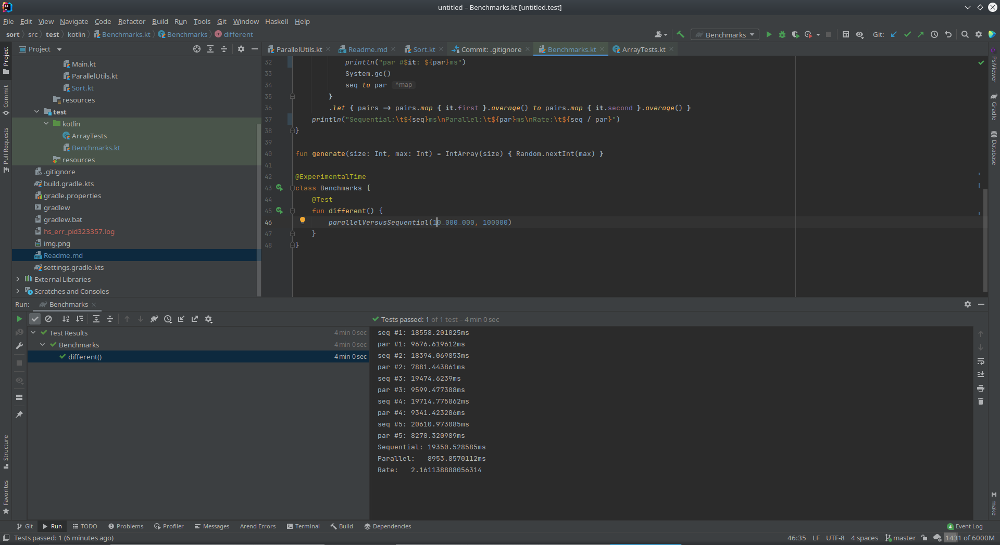
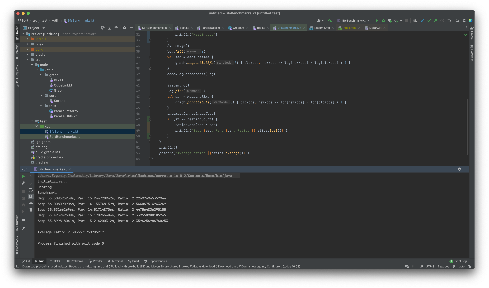

My sort output is:
```yaml
seq #1: 18558.201025ms
par #1: 9676.619612ms
seq #2: 18394.069853ms
par #2: 7881.443861ms
seq #3: 19474.6239ms
par #3: 9599.477388ms
seq #4: 19714.775062ms
par #4: 9341.423206ms
seq #5: 20610.973085ms
par #5: 8270.320989ms
Sequential:	19350.528585ms
Parallel:	8953.8570112ms
Rate:	        2.161138888056314
```
Every even row is temporary parallel or sequential result time.



---

My BFS output is:
```kotlin
Seq: 50.642763700s, Par: 25.580496146s, Ratio: 1.9797412611138492
Seq: 53.194839704s, Par: 21.941604628s, Ratio: 2.4243823825043904
Seq: 53.295811907s, Par: 23.064672718s, Ratio: 2.3107118214344826
Seq: 50.923652227s, Par: 22.843449095s, Ratio: 2.2292453304762208
Seq: 50.480597217s, Par: 23.333747158s, Ratio: 2.1634157975219455

Average ratio: 2.221499318610178
```

