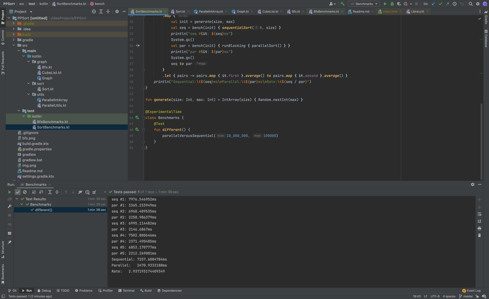

My sort output is:
```yaml
seq #1: 7976.546952ms
par #1: 3365.233949ms
seq #2: 6960.409535ms
par #2: 2258.986379ms
seq #3: 6995.114482ms
par #3: 2146.6867ms
seq #4: 7502.800646ms
par #4: 2371.490485ms
seq #5: 6853.170777ms
par #5: 2212.269081ms
Sequential:	7257.6084784ms
Parallel:	2470.9333188ms
Rate:	2.937193174409349
```
Every even row is temporary parallel or sequential result time.



---

My BFS output is:
```kotlin
Seq: 50.642763700s, Par: 25.580496146s, Ratio: 1.9797412611138492
Seq: 53.194839704s, Par: 21.941604628s, Ratio: 2.4243823825043904
Seq: 53.295811907s, Par: 23.064672718s, Ratio: 2.3107118214344826
Seq: 50.923652227s, Par: 22.843449095s, Ratio: 2.2292453304762208
Seq: 50.480597217s, Par: 23.333747158s, Ratio: 2.1634157975219455

Average ratio: 2.221499318610178
```

